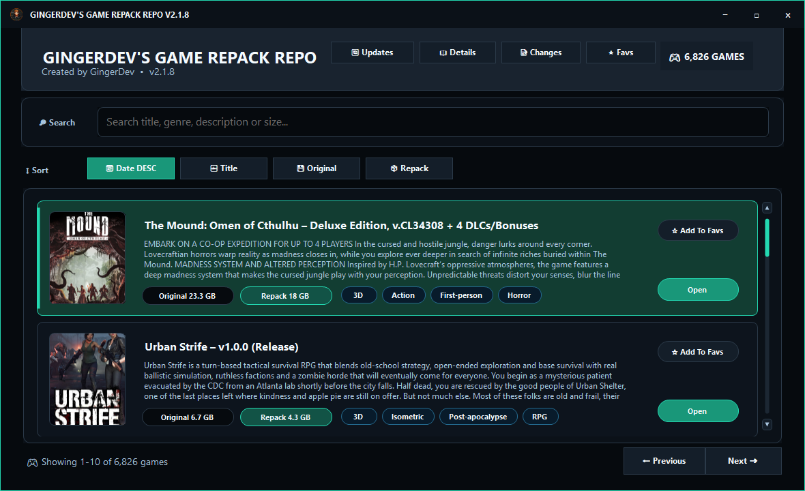
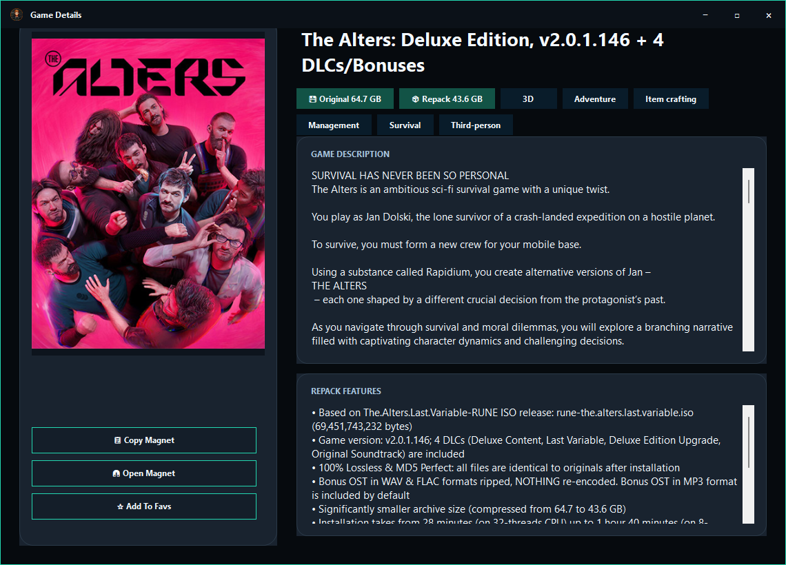
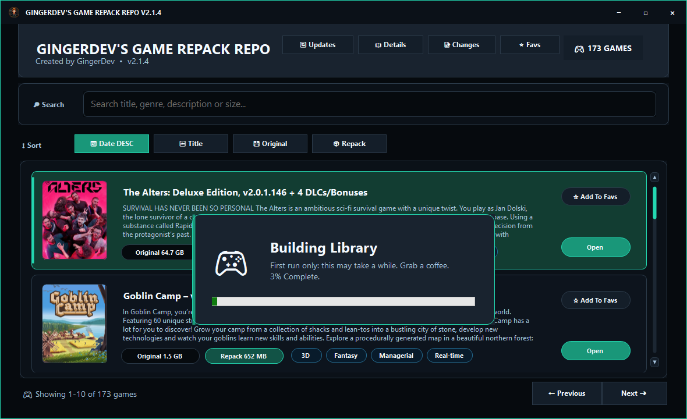

<h1 align="center">GingerDev's Game Repack Repo</h1>

  <strong>A polished Windows desktop index for browsing game repacks with covers, search, paging, details, and magnet actions.</strong>

  
  
  
  
  

  

  GingerDev's Game Repack Repo is a standalone C# Windows Forms app with a custom dark UI, animated first-run splash screen, local caching, cover art, sortable game cards, and a compact details view.

  <a href="https://raw.githubusercontent.com/GingerDev0/Game-Repack-Repo/main/GingerDev_Game_Repack_Repo_Setup_v1.0.5_With_Runtime.exe">
    <strong>Download Bundled Installer</strong>
  </a>

<h2>Preview</h2>

<table>
  <tr>
    <td width="50%">
      <h3 align="center">Game Details</h3>
      
    </td>
    <td width="50%">
      <h3 align="center">First Launch</h3>
      
    </td>
  </tr>
</table>

<h2>Highlights</h2>

<table>
  <tr>
    <td><strong>Custom UI</strong></td>
    <td>Borderless dark theme with branded chrome, custom controls, and polished game cards.</td>
  </tr>
  <tr>
    <td><strong>Fast Browsing</strong></td>
    <td>Search, sorting, 20-result paging, and local cover caching for repeat launches.</td>
  </tr>
  <tr>
    <td><strong>Rich Details</strong></td>
    <td>Cover image, title, original size, repack size, game description, repack features, and magnet actions.</td>
  </tr>
  <tr>
    <td><strong>Local Library</strong></td>
    <td>Loads from the AppData <code>list.txt</code> on startup and can append new games during update checks.</td>
  </tr>
  <tr>
    <td><strong>Version Check</strong></td>
    <td>Includes a lightweight updater. Opening the main app hands off to the updater, checks GitHub, installs newer builds when available, and then reopens the app.</td>
  </tr>
  <tr>
    <td><strong>Standalone Release</strong></td>
    <td>The bundled installer includes the .NET 9 Desktop Runtime, the main app, and the updater.</td>
  </tr>
</table>

<h2>Runtime Files</h2>

The app keeps its local data in AppData:

<pre><code>%APPDATA%\GingerDev\Game Repack Repo\</code></pre>

<table>
  <thead>
    <tr>
      <th>File or folder</th>
      <th>What it does</th>
    </tr>
  </thead>
  <tbody>
    <tr>
      <td><code>list.txt</code></td>
      <td>Local game index loaded on startup.</td>
    </tr>
    <tr>
      <td><code>list.backup.txt</code></td>
      <td>Backup created before list rewrites or appends.</td>
    </tr>
    <tr>
      <td><code>app.settings</code></td>
      <td>Window size, sort state, and search preferences.</td>
    </tr>
    <tr>
      <td><code>image-cache\</code></td>
      <td>Cached cover images for faster repeat browsing.</td>
    </tr>
  </tbody>
</table>

<blockquote>
  The animated splash GIF is embedded into the app, so no external <code>Assets</code> folder is required for the published executable.
</blockquote>

<h2>What The Repo Files Do</h2>

<table>
  <thead>
    <tr>
      <th>File</th>
      <th>Purpose</th>
    </tr>
  </thead>
  <tbody>
    <tr>
      <td><a href="https://raw.githubusercontent.com/GingerDev0/Game-Repack-Repo/main/GingerDev_Game_Repack_Repo_Setup_v1.0.5_With_Runtime.exe"><code>GingerDev_Game_Repack_Repo_Setup_v1.0.5_With_Runtime.exe</code></a></td>
      <td>Recommended installer. Includes the .NET 9 Desktop Runtime, installs the main app and updater, and enables automatic update checks.</td>
    </tr>
    <tr>
      <td><a href="https://github.com/GingerDev0/Game-Repack-Repo/blob/main/GingerDev's%20Game%20Repack%20Repo.exe"><code>GingerDev's Game Repack Repo.exe</code></a></td>
      <td>Portable main app only. This runs without the updater beside it, so it will not auto-update. If you download only this file, you must manually replace it when a new version is released.</td>
    </tr>
    <tr>
      <td><code>GingerDev's Game Repack Repo Updater.exe</code></td>
      <td>Updater helper used by the installed app. It checks GitHub, verifies the downloaded main executable with SHA-256, replaces the old executable, and then launches the app.</td>
    </tr>
  </tbody>
</table>

<blockquote>
  Side note: downloading the main app and updater individually will work side-by-side as long as both files are kept in the same folder. Downloading only <code>GingerDev's Game Repack Repo.exe</code> is portable/manual-update mode and skips update checks altogether.
</blockquote>

<h2>Update Check</h2>

  Launch <code>GingerDev's Game Repack Repo.exe</code> normally. If the updater is installed beside it, the main app immediately hands off to <code>GingerDev's Game Repack Repo Updater.exe</code> and closes.

  The updater checks <code>etc/update.json</code> from GitHub, compares the installed version, downloads the newer executable when available, swaps it in safely, then launches the main app again and closes itself.

  If GitHub is unreachable or no update is available, the updater simply opens the installed version.

<h2>First Run</h2>

  If <code>list.txt</code> does not exist in AppData, the app builds a local library on first launch.

  The first build scans the archive and saves usable entries locally. It can take a while, but future launches load from <code>list.txt</code> first and then check for new games.

<h2>Download</h2>

<table>
  <tr>
    <td><strong>Supported OS</strong></td>
    <td>Windows x64</td>
  </tr>
  <tr>
    <td><strong>Current version</strong></td>
    <td><code>2.1.0</code></td>
  </tr>
  <tr>
    <td><strong>Recommended download</strong></td>
    <td><a href="https://raw.githubusercontent.com/GingerDev0/Game-Repack-Repo/main/GingerDev_Game_Repack_Repo_Setup_v1.0.5_With_Runtime.exe"><code>GingerDev_Game_Repack_Repo_Setup_v1.0.5_With_Runtime.exe</code></a></td>
  </tr>
  <tr>
    <td><strong>Installer SHA-256</strong></td>
    <td><code>F8B9DD15C8DB4AB3CDB8E83E92CB000844E6A1FFB40DC4C338030F9B45B11157</code></td>
  </tr>
</table>

  The installer includes the .NET 9 Desktop Runtime and the updater. After installation, open the app normally from the Start Menu or desktop shortcut; the updater will fetch the latest main executable when a newer version is available.

<h2>License</h2>

  This project is licensed under the <a href="https://github.com/GingerDev0/Game-Repack-Repo/tree/main#GPL-3.0-1-ov-file">GPL-3.0 license</a>.

<h2>Disclaimer</h2>

  This project is an indexing/browser tool. It does not host game files, cracks, installers, or torrents. Any external links or magnet links are sourced from third-party pages and are outside this repository.

  Use responsibly and follow the laws that apply in your location.

