<h1 align="center">GingerDev's Game Repack Repo Themes</h1>

  Each theme family includes a Light and Dark mode.

  <a href="README.md">Back to README</a>

<h2>Bootstrap</h2>

<table>
  <tr>
    <td width="50%">
      <h3 align="center">Bootstrap Light</h3>
      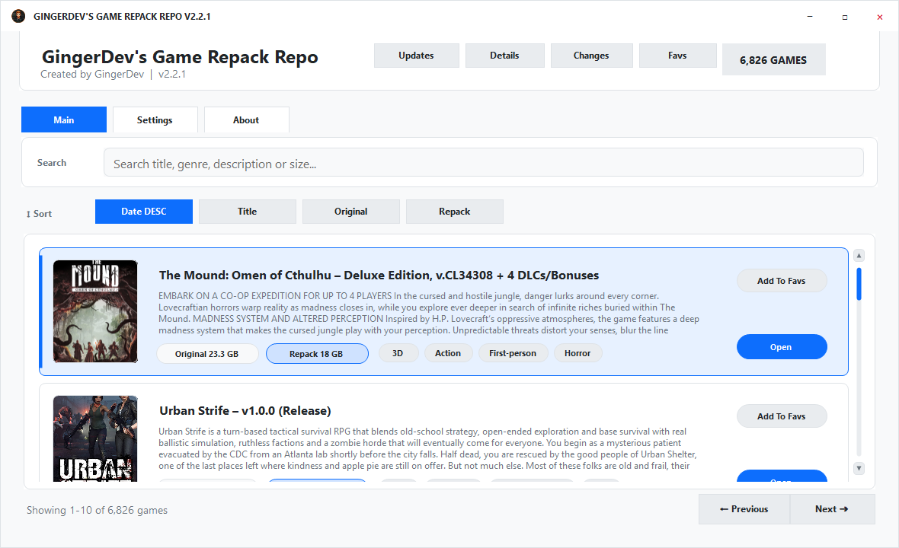
    </td>
    <td width="50%">
      <h3 align="center">Bootstrap Dark</h3>
      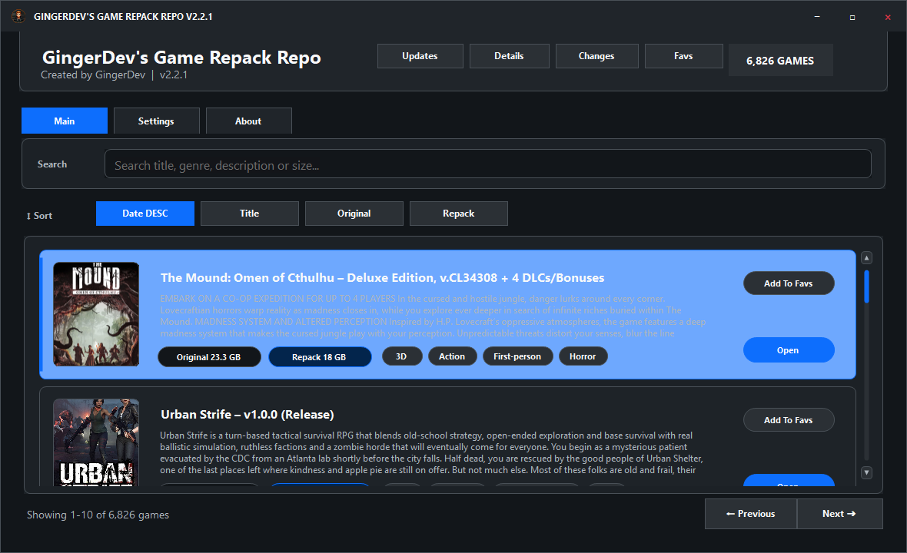
    </td>
  </tr>
</table>

<h2>Mint</h2>

<table>
  <tr>
    <td width="50%">
      <h3 align="center">Mint Light</h3>
      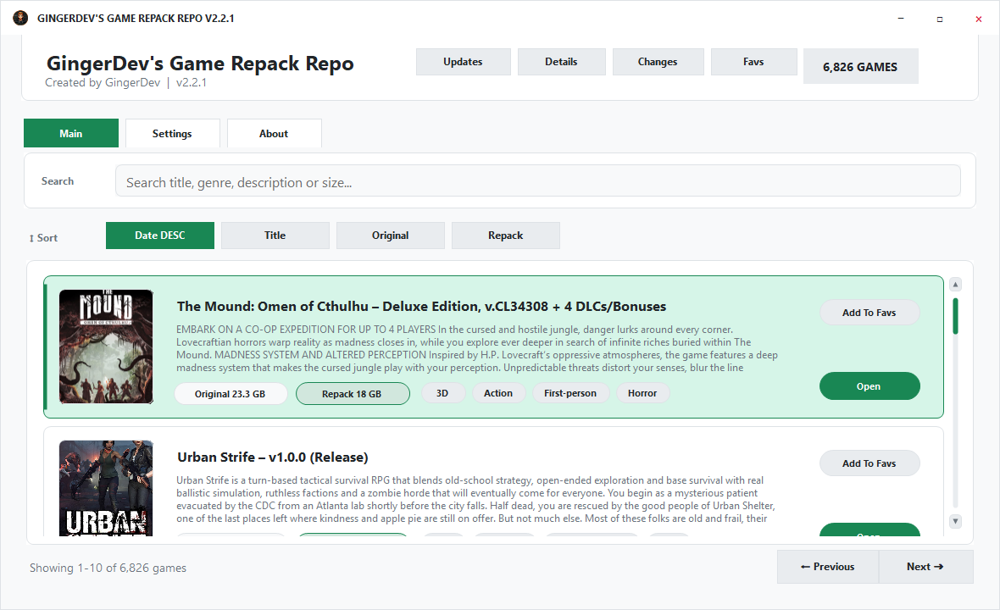
    </td>
    <td width="50%">
      <h3 align="center">Mint Dark</h3>
      
    </td>
  </tr>
</table>

<h2>Rose</h2>

<table>
  <tr>
    <td width="50%">
      <h3 align="center">Rose Light</h3>
      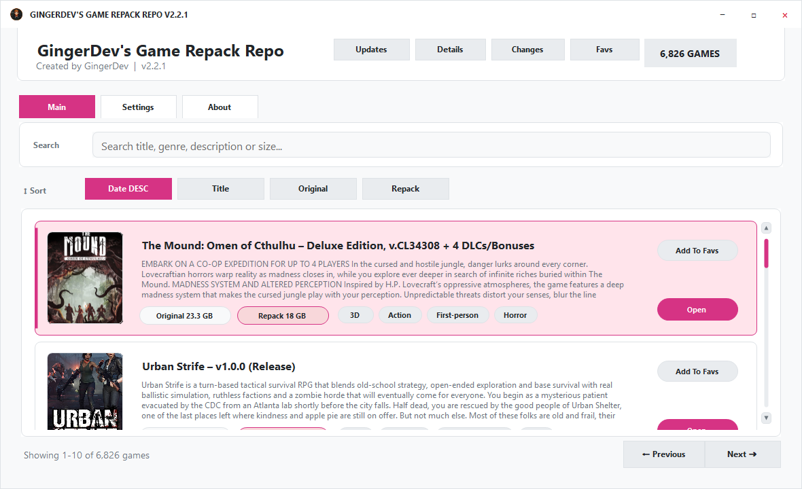
    </td>
    <td width="50%">
      <h3 align="center">Rose Dark</h3>
      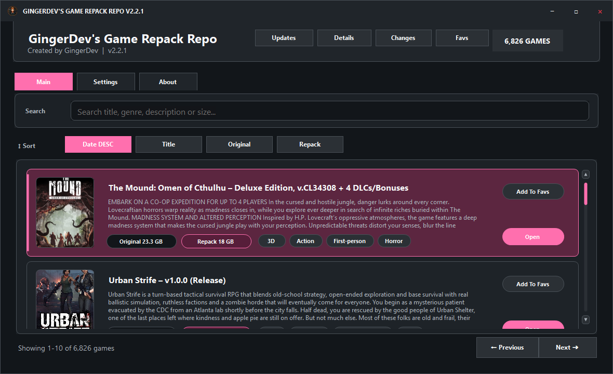
    </td>
  </tr>
</table>

<h2>Slate</h2>

<table>
  <tr>
    <td width="50%">
      <h3 align="center">Slate Light</h3>
      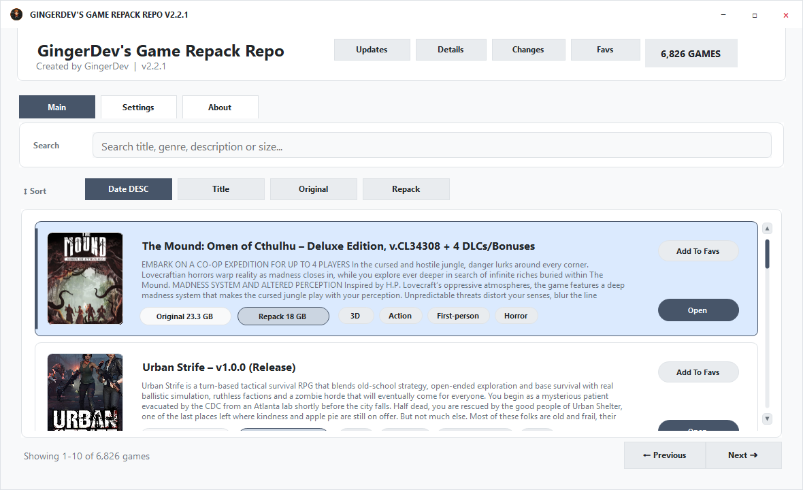
    </td>
    <td width="50%">
      <h3 align="center">Slate Dark</h3>
      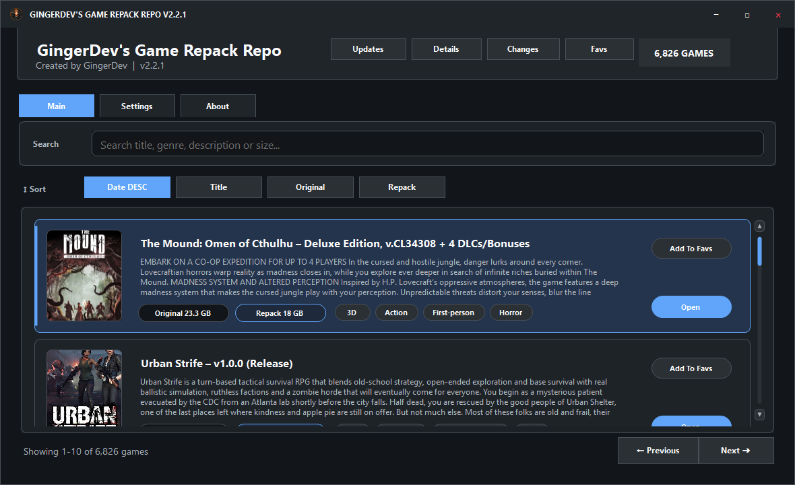
    </td>
  </tr>
</table>

<h2>Indigo</h2>

<table>
  <tr>
    <td width="50%">
      <h3 align="center">Indigo Light</h3>
      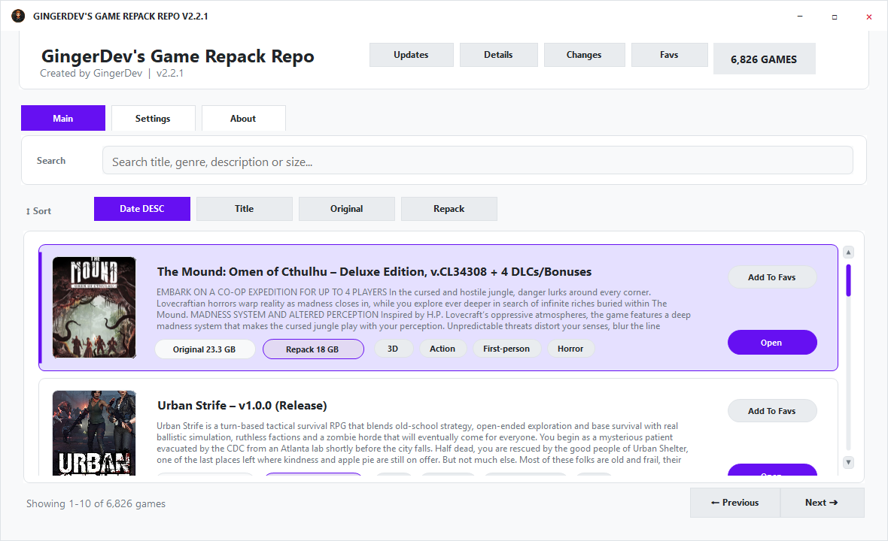
    </td>
    <td width="50%">
      <h3 align="center">Indigo Dark</h3>
      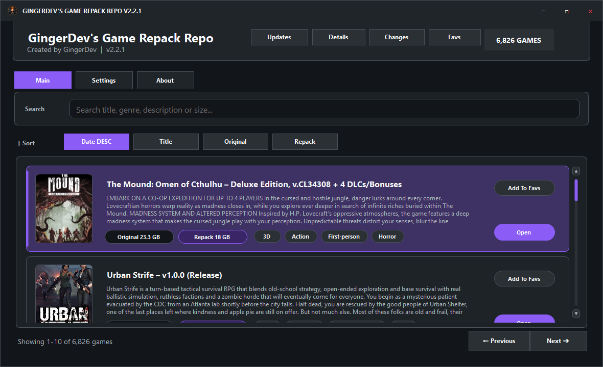
    </td>
  </tr>
</table>

<h2>Cyan</h2>

<table>
  <tr>
    <td width="50%">
      <h3 align="center">Cyan Light</h3>
      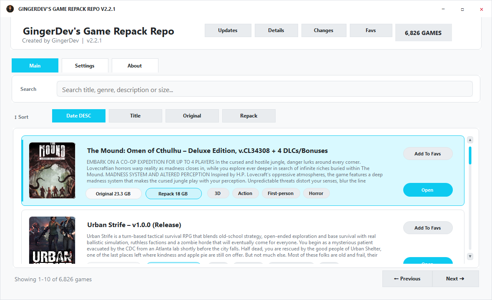
    </td>
    <td width="50%">
      <h3 align="center">Cyan Dark</h3>
      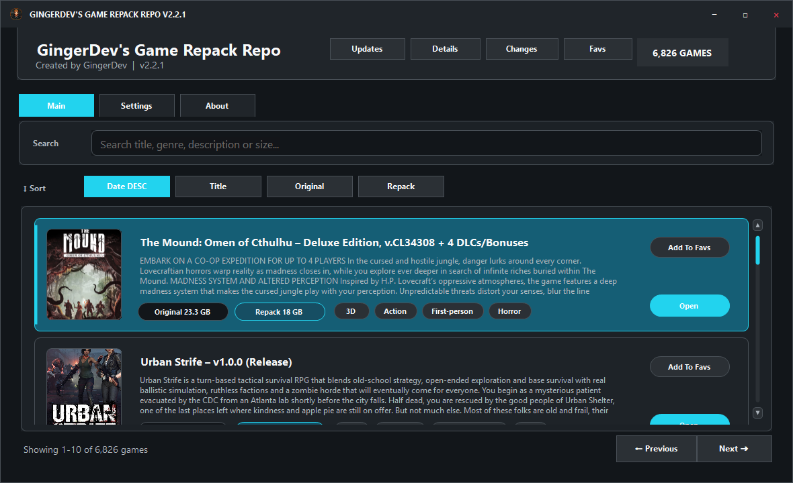
    </td>
  </tr>
</table>

<h2>Amber</h2>

<table>
  <tr>
    <td width="50%">
      <h3 align="center">Amber Light</h3>
      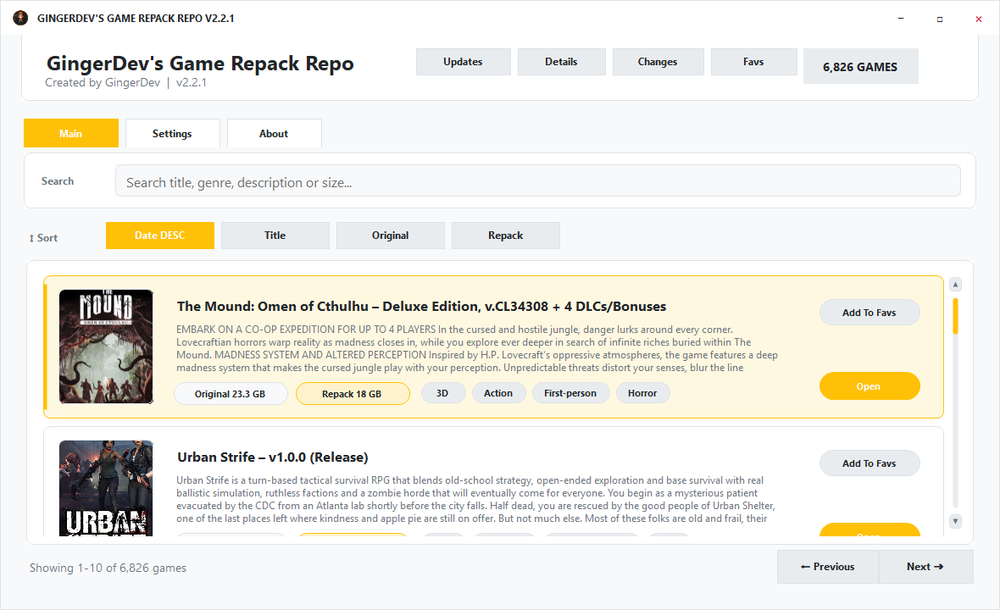
    </td>
    <td width="50%">
      <h3 align="center">Amber Dark</h3>
      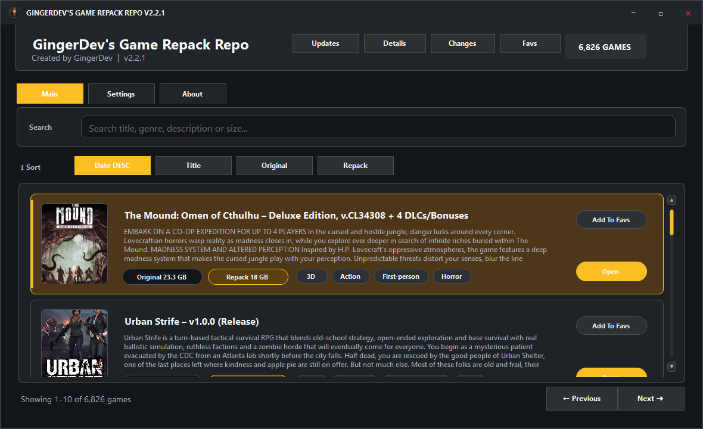
    </td>
  </tr>
</table>

<h2>Graphite</h2>

<table>
  <tr>
    <td width="50%">
      <h3 align="center">Graphite Light</h3>
      
    </td>
    <td width="50%">
      <h3 align="center">Graphite Dark</h3>
      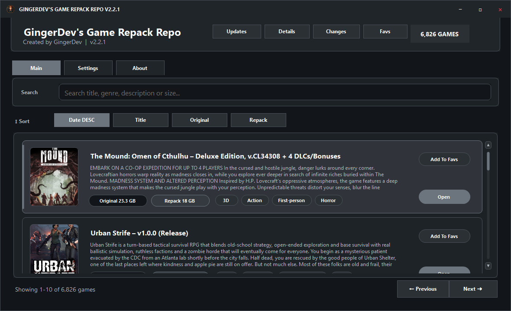
    </td>
  </tr>
</table>

<h2>Forest</h2>

<table>
  <tr>
    <td width="50%">
      <h3 align="center">Forest Light</h3>
      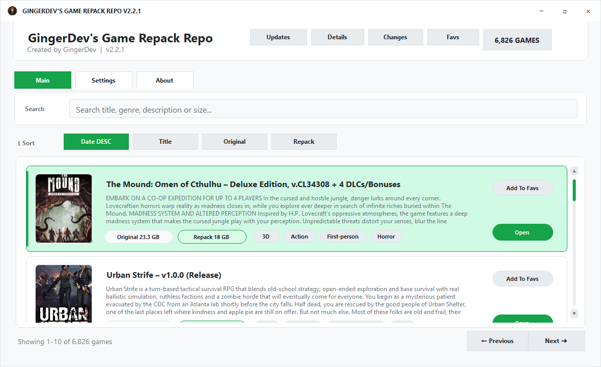
    </td>
    <td width="50%">
      <h3 align="center">Forest Dark</h3>
      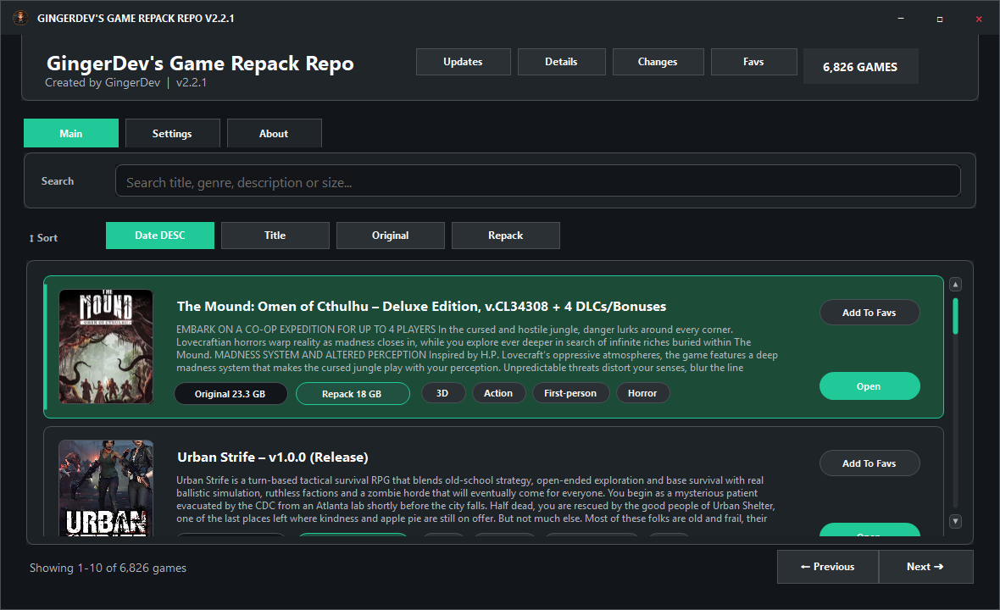
    </td>
  </tr>
</table>
